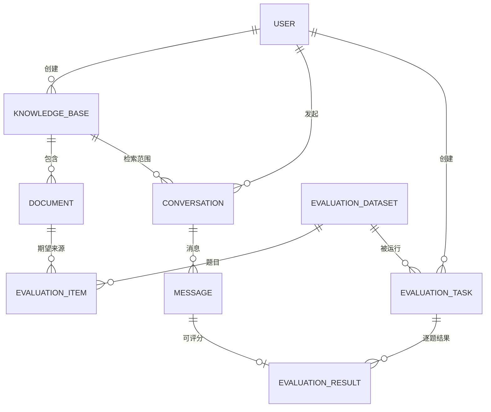

# 03 数据库设计

> 建库脚本: `sql/init.sql`(MySQL 8, utf8mb4)。共 **13 张表**, 满足课题 ≥11 张要求。

## 1. 设计约定

- 主键统一 `BIGINT AUTO_INCREMENT`;
- 审计字段: `created_at DATETIME DEFAULT CURRENT_TIMESTAMP`, `updated_at ... ON UPDATE CURRENT_TIMESTAMP`;
- 逻辑删除: `deleted TINYINT DEFAULT 0`(MyBatis-Plus `@TableLogic`, 查询自动过滤);
- 高频查询字段建索引(外键关联列、时间列、状态列);
- 使用 InnoDB, 不使用外键约束(应用层保证一致性, 便于批量与维护)。

## 2. 表清单与职责

| # | 表名 | 职责 |
|---|------|------|
| 1 | `role` | 角色字典(ADMIN/USER) |
| 2 | `user` | 用户账号(BCrypt 密码、角色、状态) |
| 3 | `knowledge_base` | 知识库元数据(名称/描述/分类/封面色/统计快照) |
| 4 | `document` | 文档记录(原始文件名、存储文件名、大小、状态机、错误信息) |
| 5 | `conversation` | 会话(用户-知识库-标题, 问答入口) |
| 6 | `message` | 会话消息(角色/内容/sources JSON) |
| 7 | `qa_record` | 问答流水(retrievalTime/generationTime/token 数/引用数) |
| 8 | `feedback` | 回答反馈(rating 1-5 / comment) |
| 9 | `rag_config` | 全局 RAG 参数(单行, id=1) |
| 10 | `evaluation_dataset` | 评测数据集 |
| 11 | `evaluation_item` | 评测题目(参考答案/期望关键词/期望来源/类别) |
| 12 | `evaluation_task` | 评估任务(模式/参数/状态/汇总指标 JSON) |
| 13 | `evaluation_result` | 逐题结果(自动指标 + 人工评分字段) |

## 3. 核心表结构(节选关键字段)

### 3.1 user

```sql
CREATE TABLE `user` (
    `id`         BIGINT NOT NULL AUTO_INCREMENT,
    `username`   VARCHAR(50) NOT NULL COMMENT '登录名(唯一)',
    `password`   VARCHAR(100) NOT NULL COMMENT 'BCrypt 哈希',
    `nickname`   VARCHAR(50),
    `email`      VARCHAR(100),
    `role_id`    BIGINT NOT NULL DEFAULT 2 COMMENT '1管理员 2普通用户',
    `status`     TINYINT NOT NULL DEFAULT 1 COMMENT '1启用 0禁用',
    `created_at` DATETIME NOT NULL DEFAULT CURRENT_TIMESTAMP,
    `updated_at` DATETIME NOT NULL DEFAULT CURRENT_TIMESTAMP ON UPDATE CURRENT_TIMESTAMP,
    `deleted`    TINYINT NOT NULL DEFAULT 0,
    PRIMARY KEY (`id`),
    UNIQUE KEY `uk_username` (`username`),
    KEY `idx_role` (`role_id`)
) ENGINE=InnoDB COMMENT='用户表';
```

### 3.2 document(状态机)

```sql
`original_name` VARCHAR(255)  -- 原始文件名(展示用)
`stored_name`   VARCHAR(255)  -- 服务端随机文件名(UUID+白名单扩展名)
`file_size`     BIGINT
`file_type`     VARCHAR(20)
`status`        VARCHAR(20)   -- PENDING/PARSING/EMBEDDING/COMPLETED/FAILED
`error_message` VARCHAR(1000) -- FAILED 时记录原因
`chunk_count`   INT DEFAULT 0
`knowledge_base_id` BIGINT NOT NULL
KEY `idx_kb_status` (`knowledge_base_id`, `status`)
```

### 3.3 message / qa_record(引用溯源)

- `message.sources JSON`: 助手消息保存完整引用列表(documentName/page/content/score), 前端"展开引用"直接取用, 无需回查向量库;
- `qa_record`: 每次 QA 独立落一条流水, 记录 `retrieval_time_ms / generation_time_ms / prompt_tokens / completion_tokens / source_count`, 支撑统计页与评估耗时分析。

### 3.4 evaluation_task / evaluation_result

```sql
-- evaluation_task
`mode`          VARCHAR(20)   -- LLM_ONLY / RAG_LLM
`top_k` `chunk_size` `temperature` ...  -- 实验参数快照
`status`        VARCHAR(20)   -- PENDING/RUNNING/COMPLETED/FAILED
`metrics`       JSON          -- 任务级汇总指标(retrieval_hit_rate 等)

-- evaluation_result(逐题)
`retrieval_hit` TINYINT       -- 是否命中期望来源
`precision_at_k` `recall_at_k` DECIMAL(6,4)
`keyword_hit_rate` DECIMAL(6,4)
`citation_matched` DECIMAL(6,4)
`is_hallucination` TINYINT    -- 人工标注
`manual_relevance` `manual_accuracy` `manual_completeness` TINYINT  -- 人工评分 1-5
`answer` TEXT / `sources` JSON / `error` VARCHAR(500)   -- error: 单题失败原因(成功为 NULL)
```

**设计要点**: 人工评分与自动指标分离存储, 人工评分可在任务完成后补充提交(不修改自动指标, 审计可追溯); `metrics` JSON 避免为每个实验组合建宽表。

### 3.5 rag_config(单行配置)

```sql
INSERT INTO rag_config VALUES (1, 512, 100, 5, 0.30, 0.300, 0, 3, 6, 1);
-- chunk_size=512, overlap=100, top_k=5, temperature=0.3, threshold=0.3,
-- reranker 关, rerank_top_n=3, history_window=6
```

系统启动后所有问答默认读取该行; 管理员可在"参数设置"页修改; 单次问答请求可覆盖 top_k/temperature(支撑前端临时调参与评估实验)。

## 4. 初始化数据

`init.sql` 内置:

- 2 个角色 + 2 个演示账号: `admin/admin123`(管理员)、`user/user123`(普通用户), 密码为真实 BCrypt 哈希(`$2a$10$...`);
- 3 个示例知识库(Web安全 / Java安全 / API安全);
- rag_config 默认参数行(id=1);
- 1 个评测数据集 + **15 道评测题目**(含参考答案、期望关键词、期望来源文档名, 与 `dataset/` 示例文档一一对应, 支撑开箱即用的对比实验)。

## 5. 与向量库的关系

MySQL 保存**业务元数据与结构化结果**; Chroma 保存**文本块向量与溯源元数据**(document_id/document_name/knowledge_base_id/chunk_index/source/page)。两者通过 `document_id` 与 `knowledge_base_id` 关联:

- 删除文档: backend 先调 rag-service 删除该 document_id 的全部向量, 再逻辑删除 MySQL 记录、清理文件;
- 知识库检索范围: conversation 绑定 knowledge_base_id 列表 → rag-service 限定查询对应 `kb_{id}` 集合, 实现**检索级隔离**。

## ER 图(Mermaid, 核心实体)


