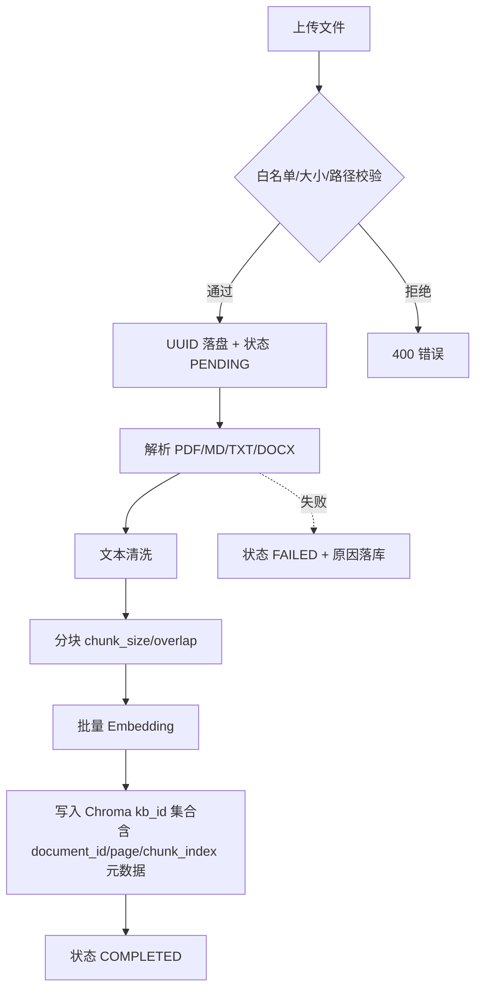
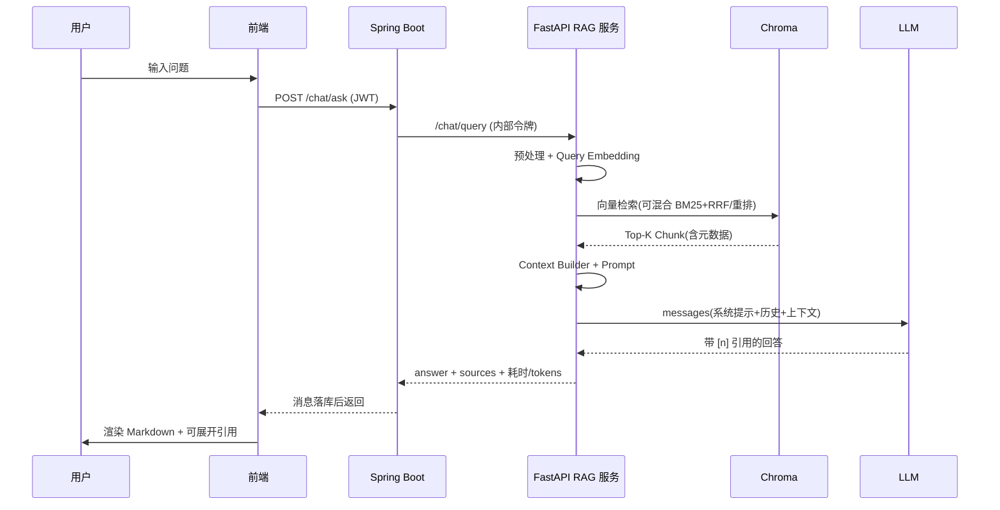

# 04 RAG 流程设计

> 对应代码: `rag-service/app/{document,rag,embedding,vectorstore}/`, 是系统的核心链路。

## 1. 总体流水线

```
【离线索引】                      【在线问答】
上传文件                          用户提问
  │ 解析 parser                    │ 查询预处理 preprocess_query
  │ 清洗 cleaner                   │ 查询向量化 embed_query
  │ 分块 chunker                   │ 向量检索 Chroma Top-K
  │ 向量化 embed(批量)             │ (可选)CrossEncoder 重排
  │ 入库 Chroma                    │ 上下文构造 build_context
  └ 元数据随存                     │ Prompt 组装(系统+历史+问题)
                                   │ LLM 生成(带引用要求)
                                   └ 返回 {answer, sources[], 耗时}
```

## 2. 离线索引阶段

### 2.1 文档解析(parser.py)

- **白名单**: 仅 `.pdf / .txt / .md / .markdown / .docx`;
- **安全校验**: `validate_file` 检查大小(≤ `MAX_FILE_SIZE_MB`)与扩展名, 文件名经 `Path(filename).name` 归一防目录穿越;
- **PDF**: pypdf 逐页提取, 记录页码 `DocumentPage(text, page)`, 支撑引用级溯源(引用可精确到页);
- **TXT**: UTF-8 优先, 失败回退 GB18030(中文文档兼容);
- **DOCX**: python-docx 按段落提取。

### 2.2 清洗(cleaner.py)

规则依次: ① 去除控制字符(保留 `\n`/`\t`); ② NFKC 规范化(全半角统一); ③ 去除装饰线(`----`/`====` 等); ④ 去除纯页码行; ⑤ 行内连续空白压缩; ⑥ 连续空行压缩。清洗在分块前执行, 避免噪声进入向量库污染检索。

### 2.3 分块(chunker.py)

- 采用 **LangChain `RecursiveCharacterTextSplitter`**(系统唯一引入的 LangChain 组件, 避免整框架引入的臃肿);
- 中文优先分隔符: `["\n\n", "\n", "。", "！", "？", "；", "，", ".", "!", "?", ";", " ", ""]`, 优先按语义边界切分;
- **页感知分块 `chunk_pages`**: 每页独立切分(跨页内容不互相污染、页码准确), 再全局顺序编号 `chunk_index`;
- 参数: `chunk_size`(默认 512)/`chunk_overlap`(默认 100), 支持评估实验对比 {256, 512, 1024};
- 参数校验: `chunk_size > 0`, `0 <= overlap < chunk_size`, 非法参数抛 `ValueError`。

### 2.4 向量化(embedding/)

- Provider 抽象(`BaseEmbedding.embed_documents/embed_query/info`), 两实现:
  - `LocalBGEEmbedding`: sentence-transformers 本地推理, 默认 `BAAI/bge-m3`(可切轻量 `BAAI/bge-small-zh-v1.5`), 懒加载 + `normalize_embeddings=True`(单位向量, cosine 与内积等价);
  - `OpenAICompatibleEmbedding`: 走 OpenAI 兼容 API(密钥环境变量注入);
- 工厂单例 + 线程锁, 模型只加载一次; 批量向量化(每批 ≤1000 条)写入。

### 2.5 向量入库(chroma_store.py)

- Chroma `PersistentClient` 落盘目录由 `CHROMA_PERSIST_DIR` 配置;
- **每个知识库一个集合** `kb_{id}`, 集合级隔离, 多库检索 = 分别查询后合并;
- HNSW 索引, 度量 `cosine`;
- 每 Chunk 元数据: `document_id, document_name, knowledge_base_id, chunk_index, source, page` —— 引用溯源的全部信息随向量同存;
- 提供按 `document_id` 删除(文档下架)、按集合删除(知识库删除)。

## 3. 在线问答阶段

### 3.1 查询预处理

`preprocess_query`: 去首尾空白、压缩连续空白、过滤空问题(422), 保证 Embedding 输入干净。

### 3.2 检索与重排(retriever.py / reranker.py)

```
retrieve(query, kb_ids, top_k, score_threshold, enable_reranker, rerank_top_n)
  → embed_query(query)
  → 各 kb 集合查询(重排开启时召回 top_k*4 扩大候选)
  → 合并、按 score 降序、score_threshold 过滤
  → enable_reranker: CrossEncoder(BAAI/bge-reranker-base) 对候选精排, 取前 rerank_top_n
  → 返回 RetrievedChunk(content + 全部元数据 + score)
```

`score = 1 - cosine_distance`(保留 4 位小数), 语义即"相似度", 直接用于前端展示与阈值过滤。

### 3.3 上下文构造(context_builder.py)

将 Top-K 片段编号拼接:

```
[1] (来源: SQL注入防护指南.md 第3页)
使用参数化查询防止 SQL 注入...

[2] (来源: ...) ...
```

编号与最终 sources 列表一一对应, 是引用标注的锚点。

### 3.4 Prompt 设计(prompts.py)

- `RAG_SYSTEM_PROMPT` 核心约束(防幻觉三原则):
  1. **仅依据知识库片段回答**, 片段之外的先验知识需明示;
  2. **引用强制**: 使用到某片段时必须标注 `[n]`;
  3. **诚实拒答**: 知识库未找到依据时, 明确回答"知识库中未找到相关依据", 不得编造;
- 用户 Prompt = `RAG_USER_TEMPLATE.format(context, question)`;
- 多轮对话: 历史(`history_window` 默认 6 条)以 user/assistant 消息插入, 保留指代语境; 单条历史截断 2000 字符防上下文爆炸。

### 3.5 生成与返回(pipeline.py)

- LLM 走环境变量配置(`LLM_PROVIDER/LLM_BASE_URL/LLM_API_KEY/LLM_MODEL`), 支持 OpenAI 兼容(`/chat/completions`)与 Anthropic 兼容(`/v1/messages`)两种协议, 返回内容 + token 用量 + 延迟;
- `PipelineResult.to_dict()` 输出 camelCase 契约:

```json
{
  "answer": "应使用参数化查询 [1]...",
  "sources": [{"documentName": "SQL注入防护指南.md", "page": 3,
                "content": "...", "score": 0.88, "chunkIndex": 0}],
  "retrievalTime": 45, "generationTime": 1200, "totalTime": 1245,
  "promptTokens": 800, "completionTokens": 150, "totalTokens": 950,
  "retrievedCount": 5
}
```

- `llm_only_chat`: 同一 LLM、无检索的对照组, 供评估模块对比(见 06-实验设计)。

## 4. 引用与幻觉治理机制

| 机制 | 实现 |
|------|------|
| 生成约束 | 系统提示强制"仅依据片段 + 必须引用 + 无依据拒答" |
| 来源绑定 | 回答 `[n]` ↔ sources 下标一一对应, 前端可展开原文核对 |
| 阈值过滤 | score_threshold 丢弃低相关片段, 减少"被迫编造"的诱因 |
| 引用校验 | 评估模块用正则 `[(\d{1,2})]` 提取引用, 越界编号判定为伪造引用 |
| 人工标注 | 评估结果支持人工标记"是否幻觉", 形成可量化幻觉率 |

## 5. 参数与实验支撑

| 参数 | 默认 | 实验取值 | 影响 |
|------|------|---------|------|
| chunk_size | 512 | 256/512/1024 | 检索粒度 vs 上下文噪声 |
| chunk_overlap | 100 | 固定 | 边界语义连贯 |
| top_k | 5 | 1/3/5/10 | 召回 vs 噪声 |
| score_threshold | 0.3 | 固定 | 低相关过滤 |
| temperature | 0.3 | 固定 | 生成随机性(事实型问答取低) |
| enable_reranker | 关 | 开/关 | 精排对 Hit/P@K 的增益 |

所有参数经 `rag_config`(全局)与请求级覆盖双层生效, 为第 6 章实验提供单一变量控制。

## 流程图(Mermaid)

### 文档摄取链路



### 问答链路(RAG 时序)


